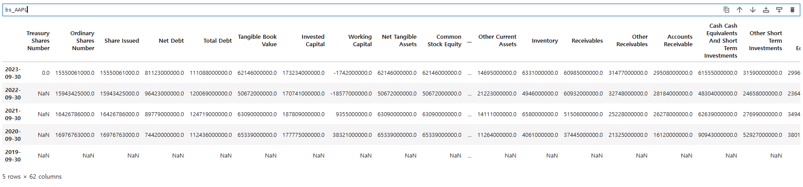
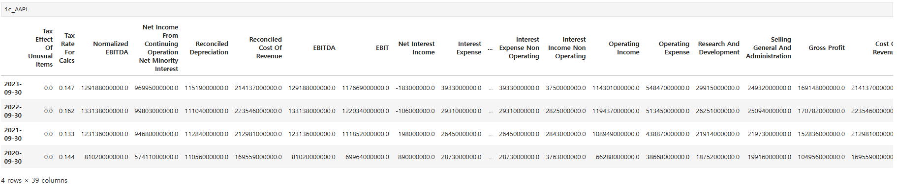
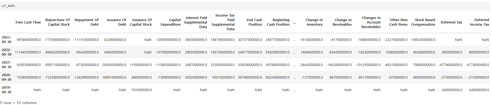
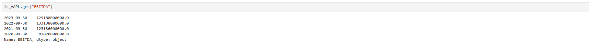

# Accounting Data from Yahoo Finance
Calculating various ratios using yahoo finance data

## **yfinance** libaray

Although there are various professional databases including Compustat for accounting and finance professionals, they can be sometimes a bit too expensive and heavy to use.

In this case, you can easily use a free libaray, **yfinance** to extract accounting data from publicly available *Yahoo Finance* website.

By extracting financial statements from Yahoo Finance, you can calculate various accounting ratios ranging from PER, PBR to more complex statistics such as Ohlson O-score (1980) or Beneish M-score (1999).

In this article, I would like to share a simple way to do this and a few examples.

## Financial Statements from **Yahoo Finance**

```python
#yahoo finance library
import yfinance as yf

#input: ticker string
#output: financial statements

def get_financial_data(ticker):
    stock = yf.Ticker(ticker)
    financials = stock.financials.T
    balance_sheet = stock.balance_sheet.T
    cashflow = stock.cashflow.T
    return financials, balance_sheet, cashflow
```

This is it!\
Using the function, `get_financial_data`, various financial statements can be extracted from Yahoo Finance. 

1. financials: income statement
2. balance_sheet: balance sheet
3. cashflow: statement of cash flow

Let's see how they are displayed.

```python
ic_AAPL, bs_AAPL, cf_AAPL = get_financial_data("AAPL")
```

#### Balance Sheet



#### Income Statement



#### Statement of Cash Flow



#### (Ex) when only a certain account is required

```python
#example: EBITDA
bs_AAPL.get("EBITDA")
```



For the above codes, check here:

[Financial_statements](https://github.com/JKang918/Computing-Accounting-Ratios-from-Yahoo-Finance/blob/main/FinancialStatements.ipynb)


## Example: More complex cases

Ok. Now we now how to extract 1. financial statements and 2. specific accounts.

We can use this to calculate more complex statistics. 

I took two examples - Ohlson O score and Beneish M score.

**O-score example is here:**

[O-score(my github, jupyter notebook)](https://github.com/JKang918/Computing-Accounting-Ratios-from-Yahoo-Finance/blob/main/Oscore.ipynb)


**M-score example is here:**

[M-score(my github, jupyter notebook)](https://github.com/JKang918/Computing-Accounting-Ratios-from-Yahoo-Finance/blob/main/Beneish.ipynb)


These might look complex but if you take a close look it is all about extracting a few accounts from financial statements and make some calculations out of them.

In case you are interested in what O-score or M-score, check out below.

[O-score(Wikipedia)](https://en.wikipedia.org/wiki/Ohlson_O-score)\
[M-score(Wikipedia)](https://en.wikipedia.org/wiki/Beneish_M-score)

O-score is a statistic to guage a firm's default probability while M-score is used to predict possible earnings manipulation.

The process can be summarized as below:

1. extract financial statements
2. extract certain accounts of interest
3. use formula or functions to get tailored ratios
4. make a table of those ratios
5. do what you need to do with that!